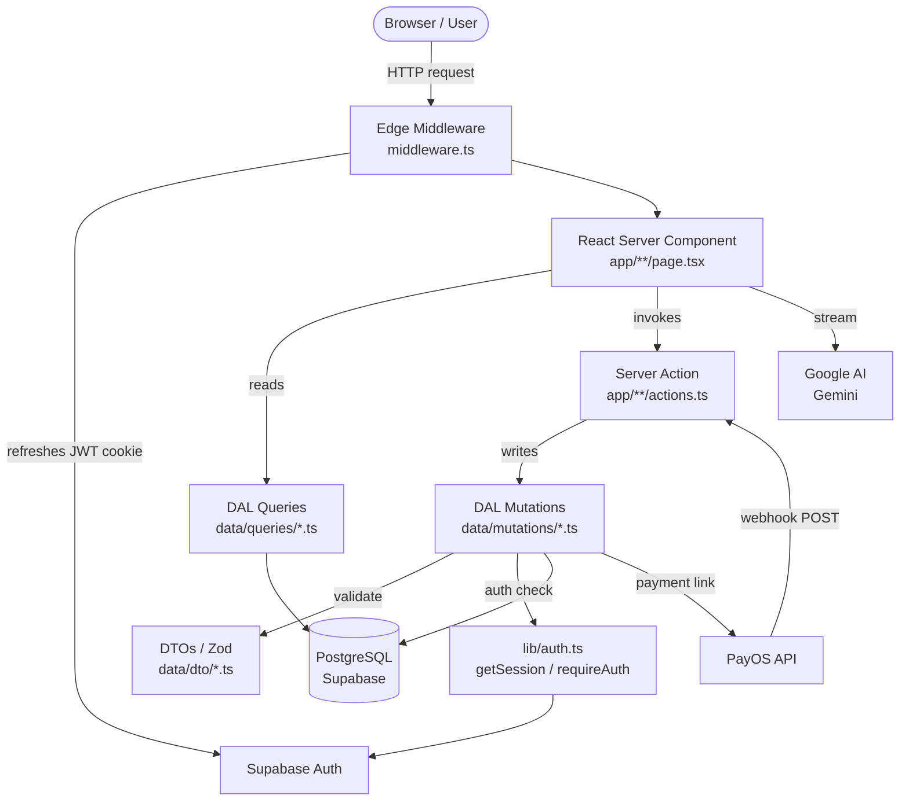
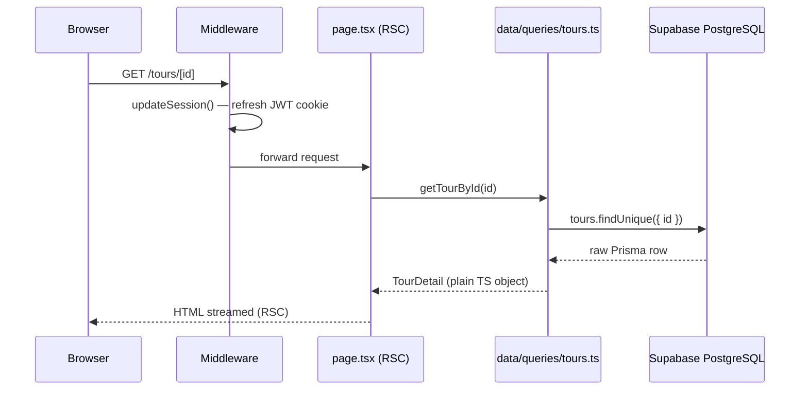
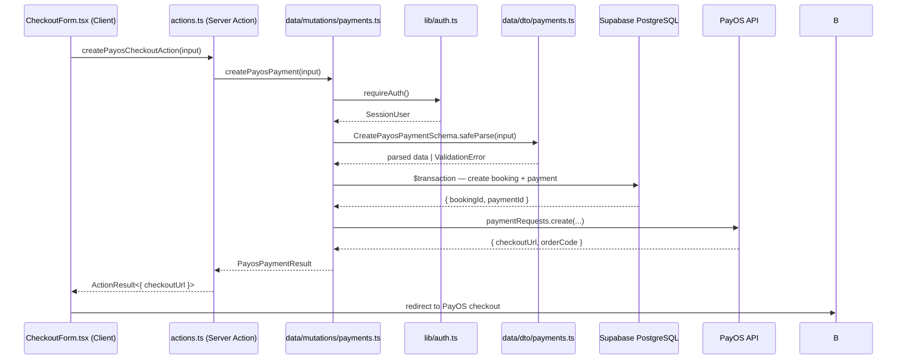
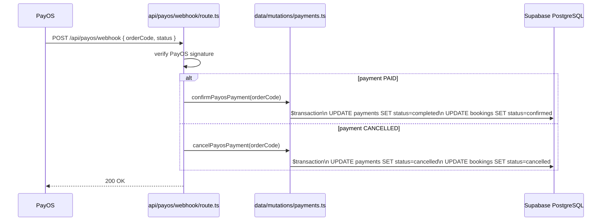
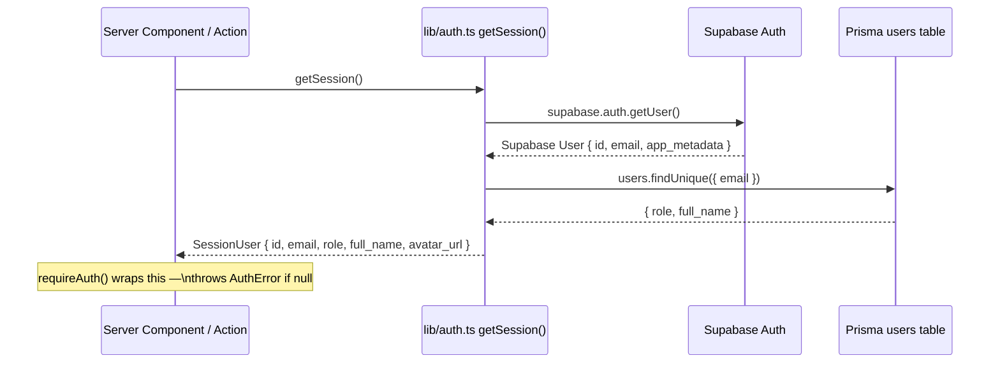

# TravelTour — Architecture Reference

> Last updated: 2026-05-11  
> Stack: **Next.js 16 App Router · React 19 · TypeScript · Tailwind v4 · shadcn/ui · Prisma · Supabase · PayOS**

---

## 1. Pattern: Layered Architecture (4-Tier)

The project follows a strict **Layered Architecture** where each layer has a single responsibility and may only call the layer directly beneath it.

```
┌─────────────────────────────────────────────────────────────┐
│  PRESENTATION LAYER                                         │
│  app/**/page.tsx  (RSC)   components/**/*.tsx               │
├─────────────────────────────────────────────────────────────┤
│  APPLICATION LAYER                                          │
│  app/**/actions.ts   ("use server" Server Actions)          │
├─────────────────────────────────────────────────────────────┤
│  DATA ACCESS LAYER  (DAL)                                   │
│  data/queries/*.ts   data/mutations/*.ts   data/dto/*.ts    │
├─────────────────────────────────────────────────────────────┤
│  INFRASTRUCTURE LAYER                                       │
│  lib/db.ts   lib/auth.ts   lib/supabase/   lib/payos.ts     │
│  prisma/schema.prisma                                       │
└─────────────────────────────────────────────────────────────┘
```

---

## 2. Directory Map

```
travel-tour/
├── app/                         # Next.js App Router (Presentation + Application layers)
│   ├── layout.tsx               # Root layout — Inter font, global ChatButton
│   ├── page.tsx                 # Landing homepage (RSC)
│   ├── globals.css              # Global styles + Tailwind v4 tokens
│   ├── (marketing)/             # Route group — public-facing pages (no shared layout file)
│   │   ├── tours/[id]/          # Tour detail page
│   │   ├── destinations/        # Destinations listing
│   │   ├── search/              # Search with filters
│   │   ├── bookings/            # User booking history (auth-gated in page)
│   │   ├── profile/             # User profile
│   │   └── checkout/
│   │       ├── [id]/            # Checkout flow for a specific tour
│   │       │   ├── page.tsx     # RSC: fetches tour + session, passes to form
│   │       │   ├── actions.ts   # Server Actions: createPayosCheckoutAction, validatePromoAction
│   │       │   ├── CheckoutForm.tsx  # Client Component — interactive form
│   │       │   └── CheckoutButton.tsx
│   │       ├── success/         # PayOS return URL — confirms payment
│   │       └── cancel/          # PayOS cancel URL
│   ├── (auth)/                  # Route group — login / register pages
│   ├── admin/                   # Protected admin section
│   │   ├── layout.tsx           # Auth gate (redirect if role !== "admin") + sidebar shell
│   │   ├── dashboard/page.tsx   # Revenue KPI dashboard (RSC, parallel data fetching)
│   │   ├── tours/               # Tour CRUD
│   │   │   ├── page.tsx
│   │   │   ├── actions.ts       # Server Actions: createTour, updateTour, deleteTour
│   │   │   └── image-actions.ts # Supabase Storage upload actions
│   │   ├── bookings/            # Booking management
│   │   ├── users/               # User management
│   │   └── reviews/             # Review moderation
│   └── api/                     # API Route Handlers (webhooks / external callbacks)
│       ├── auth/callback/       # Supabase OAuth callback
│       ├── payos/webhook/       # PayOS payment webhook → calls DAL mutations
│       ├── chat/                # AI chat stream endpoint (Google AI SDK)
│       └── health/              # Health check
│
├── components/                  # Shared UI components
│   ├── ui/                      # shadcn/ui primitives (Button, Card, Dialog, Table, …)
│   ├── admin/                   # Admin-specific components (charts, data tables, skeleton)
│   ├── landing/                 # Public marketing sections (Hero, Navbar, Footer, …)
│   ├── search/                  # SearchFilters, SortSelect
│   ├── chat/                    # AI chat UI (ChatButton, ChatPanel)
│   ├── auth/                    # Login/Register forms
│   └── theme-provider.tsx       # next-themes ThemeProvider
│
├── data/                        # DATA ACCESS LAYER
│   ├── dto/                     # Zod schemas + inferred TS types (input validation)
│   │   ├── bookings.ts          # CreateBookingSchema, UpdateBookingStatusSchema
│   │   ├── payments.ts          # CreatePayosPaymentSchema
│   │   ├── reviews.ts
│   │   ├── users.ts
│   │   ├── promotions.ts
│   │   └── wishlist.ts
│   ├── queries/                 # Pure read functions → return typed POJOs
│   │   ├── tours.ts             # getTours, getFeaturedTours, getTourById, searchTours
│   │   ├── bookings.ts          # getRevenueStats, getMonthlyRevenue, getUserBookings, …
│   │   ├── destinations.ts
│   │   ├── reviews.ts
│   │   ├── users.ts
│   │   ├── promotions.ts
│   │   ├── wishlist.ts
│   │   └── chat.ts
│   ├── mutations/               # Write operations (always validate DTO, call requireAuth)
│   │   ├── payments.ts          # createPayosPayment, confirmPayosPayment, cancelPayosPayment, repayBookingPayment
│   │   ├── bookings.ts          # updateBookingStatus, cancelBooking
│   │   ├── reviews.ts           # createReview, deleteReview
│   │   ├── users.ts             # updateUserProfile
│   │   └── wishlist.ts          # addToWishlist, removeFromWishlist
│   └── errors.ts                # Typed domain errors: NotFoundError, ValidationError, ForbiddenError
│
├── lib/                         # INFRASTRUCTURE LAYER
│   ├── db.ts                    # Prisma singleton (import `db` from here ONLY)
│   ├── auth.ts                  # getSession() → SessionUser | null; requireAuth() → SessionUser | throws
│   ├── supabase/
│   │   ├── client.ts            # Browser client (for Client Components)
│   │   ├── server.ts            # Server client + service-role client (RSC / Server Actions)
│   │   └── middleware.ts        # Session refresh logic (called by root middleware.ts)
│   ├── supabase.ts              # Re-export of createServerClient for convenience
│   ├── payos.ts                 # PayOS SDK singleton
│   ├── format.ts                # formatCurrency, formatCompact, formatDate (vi-VN locale)
│   ├── chat-context.ts          # AI system prompt builder (tour context)
│   ├── utils.ts                 # cn() — clsx + tailwind-merge
│   └── generated/prisma/        # Auto-generated Prisma client (do not edit)
│
├── prisma/
│   └── schema.prisma            # PostgreSQL schema (Supabase-hosted)
│
├── design-system/traveltour/    # Design tokens (colours, typography)
├── public/                      # Static assets (images)
├── scripts/                     # One-off scripts (seeding, migrations)
├── middleware.ts                # Edge middleware — delegates to lib/supabase/middleware.ts
├── next.config.ts
└── components.json              # shadcn/ui CLI config
```

---

## 3. Layer Responsibilities

### 3.1 Presentation Layer (`app/` pages + `components/`)

- **React Server Components** (RSC) are the default. Pages are `async` functions that call DAL queries directly and pass data down as props.
- **Client Components** (`"use client"`) are used only for interactivity (forms, modals, charts, real-time UI). They receive data as props; they do not fetch from the DB.
- Components are **co-located by domain**, not by type (e.g., `components/admin/` not `components/tables/`).

### 3.2 Application Layer (`app/**/actions.ts`)

- Every `actions.ts` file starts with `"use server"`.
- Server Actions are **thin orchestration**. They:
  1. Call the DAL (queries or mutations).
  2. Catch domain errors and map them to a serialisable `ActionResult<T>`.
  3. Never contain business logic.
- Standard return type: `ActionResult<T> = { success: true; data: T } | { success: false; error: string }`
- Admin actions also call `revalidatePath()` to bust the Next.js cache.

### 3.3 Data Access Layer — DAL (`data/`)

Three sub-layers:

| Sub-layer | Purpose | Rules |
|---|---|---|
| `data/dto/` | Zod schemas + TS types for all mutation inputs | No DB access; pure validation |
| `data/queries/` | Read-only DB functions, return plain TS objects | Call `requireAuth()` for user-scoped reads; never mutate |
| `data/mutations/` | Write functions; always run `requireAuth()` first | Validate input against DTO schema; use Prisma transactions for multi-step writes |

**The DAL has zero knowledge of HTTP, Next.js, or React.** It is reusable in API routes, Server Actions, or any Node.js context.

### 3.4 Infrastructure Layer (`lib/` + `prisma/`)

| File | What it provides |
|---|---|
| `lib/db.ts` | Prisma client singleton. **Only import from here.** |
| `lib/auth.ts` | `getSession()` (safe, never throws) · `requireAuth()` (throws `AuthError`) |
| `lib/supabase/server.ts` | `createClient()` (anon) · `createServiceClient()` (service role, bypasses RLS) |
| `lib/supabase/client.ts` | Browser-side Supabase client for Client Components |
| `lib/payos.ts` | PayOS SDK singleton |
| `lib/format.ts` | `formatCurrency` · `formatCompact` · `formatDate` — all vi-VN locale |
| `lib/utils.ts` | `cn()` utility (clsx + tailwind-merge) |

---

## 4. Auth Architecture

```
Browser
  └─► Supabase Auth (JWT in cookie)
        └─► middleware.ts  ──  refreshes session on every request
              └─► lib/supabase/middleware.ts  (updateSession)

Server Component / Server Action
  └─► getSession()  (lib/auth.ts)
        ├─► createServerClient() → supabase.auth.getUser()  [validates JWT]
        └─► db.users.findUnique({ where: { email } })  [reads role + full_name from DB]
              └─► returns SessionUser { id, email, role, full_name, avatar_url }

requireAuth()  ─  calls getSession(); throws AuthError if null
```

- **Dual source of truth**: Supabase Auth owns the session/JWT. The Prisma `users` table owns the `role` and `full_name`. `getSession()` merges both.
- **Admin gate**: `app/admin/layout.tsx` calls `getSession()` and redirects to `/` if `role !== "admin"`. The layout is `force-dynamic` to prevent caching.
- **RLS**: Supabase Row Level Security is enabled on all tables. The anon client respects RLS. The service-role client (used in server-only operations) bypasses it.

---

## 5. Data Flow Diagrams

### 5.1 System Context (high level)



---

### 5.2 Read Flow — Public RSC Page (e.g., Tour Detail)



---

### 5.3 Mutation Flow — Checkout & PayOS Payment



---

### 5.4 Webhook Flow — PayOS Payment Confirmation



---

### 5.5 Auth Flow — Session Resolution



---

## 6. Routing Structure

| Route | Type | Auth |
|---|---|---|
| `/` | RSC page | Public |
| `/tours/[id]` | RSC page | Public |
| `/destinations` | RSC page | Public |
| `/search` | RSC page | Public |
| `/checkout/[id]` | RSC page + Client form | Must be signed in (checked in mutation) |
| `/checkout/success` | RSC page | Public (PayOS callback) |
| `/bookings` | RSC page | Redirects if not signed in |
| `/profile` | RSC page | Redirects if not signed in |
| `/admin/**` | RSC pages | `role === "admin"` enforced in layout |
| `/api/auth/callback` | Route Handler | Supabase OAuth callback |
| `/api/payos/webhook` | Route Handler | PayOS signature-verified webhook |
| `/api/chat` | Route Handler | AI streaming endpoint |
| `/api/health` | Route Handler | Public |

---

## 7. Component Conventions

- **`components/ui/`** — shadcn/ui primitives. Never modify the logic; only style.
- **`components/admin/`** — display-only components. Receive all data as props. No data fetching inside.
- **`components/landing/`** — marketing sections. May accept `user: SessionUser | null` for conditional rendering.
- Co-locate small Client Components with their page when they are single-use (e.g., `CheckoutForm.tsx` lives in `app/(marketing)/checkout/[id]/`).

---

## 8. Database Schema (Prisma)

```
users ──< bookings ──── payments
  │    └─< reviews
  └────< wishlist >──┐
                     │
destinations ──< tours >┘
                 ├──< tour_images
                 ├──< bookings
                 ├──< reviews
                 └──< wishlist

users ──< chat_sessions ──< chat_messages

promotions  (standalone — no FK relations)
```

All tables use Supabase-native `uuid_generate_v4()` as primary keys. RLS is enabled on every table.

---

## 9. Key Libraries & Their Roles

| Library | Role |
|---|---|
| `next` 16 | Framework — App Router, RSC, Server Actions, Middleware |
| `react` 19 | UI runtime |
| `prisma` + `@prisma/client` | ORM — type-safe DB queries against PostgreSQL |
| `@supabase/ssr` + `@supabase/supabase-js` | Auth sessions + Storage |
| `@payos/node` | Vietnamese payment gateway SDK |
| `@ai-sdk/google` + `ai` | Google Gemini streaming chat |
| `shadcn` + Tailwind v4 | UI component system + CSS |
| `zod` | Runtime input validation (DTOs only) |
| `recharts` | Charts in admin dashboard |
| `next-themes` | Light / dark mode (admin only) |
| `lucide-react` | Icons |
| `date-fns` | Date manipulation |

---

## 10. Known Inconsistencies / Technical Debt

> ⚠️ These are places where the layer rules are violated. Be careful when adding new code nearby.

1. **`app/admin/tours/actions.ts` imports `db` directly** — bypasses the DAL. Ideally `createTour`, `updateTour`, `deleteTour` should live in `data/mutations/tours.ts`.

2. **No `data/mutations/tours.ts` exists** — tour writes are scattered in the admin `actions.ts` file instead of the DAL. Adding a `tours.ts` mutations file would enforce consistency.

3. **Rating filtering is post-query** — `searchTours()` in `data/queries/tours.ts` computes `avg_rating` in JavaScript after the DB query (Prisma can't aggregate in `where`). This works fine at current scale but is something to watch.

4. **`lib/supabase.ts`** re-exports `createServerClient` as a convenience wrapper. There are two ways to import the server client — prefer `@/lib/supabase/server` for clarity.

---

## 11. Adding New Features — Checklist

Follow this order to stay consistent with the architecture:

```
1. Schema change?
   └─► Edit prisma/schema.prisma → run `prisma generate`

2. New input type?
   └─► Add Zod schema + TS type to data/dto/<domain>.ts

3. New read?
   └─► Add function to data/queries/<domain>.ts
       - Public reads: no auth check needed
       - User-scoped: call requireAuth() at the top

4. New write?
   └─► Add function to data/mutations/<domain>.ts
       - Always: requireAuth() → DTO safeParse → db operation

5. Expose to UI?
   ├─► Server Action: add to app/**/<route>/actions.ts
   │   - "use server" at top
   │   - Return ActionResult<T>
   │   - Catch & map domain errors
   └─► Or: call query directly in RSC page.tsx

6. New UI?
   ├─► Primitive component → components/ui/
   ├─► Domain component → components/<domain>/
   └─► Single-use Client Component → co-locate in app/**/<route>/
```
